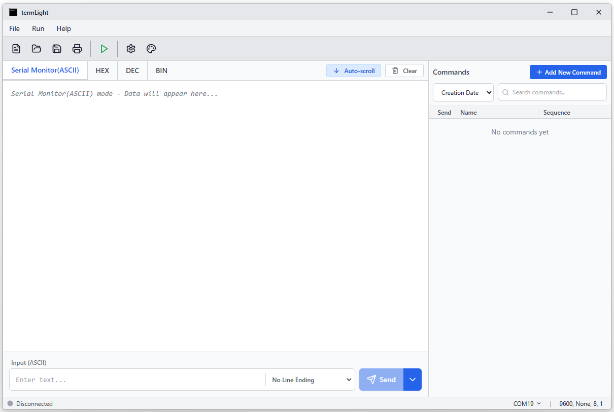

# termLight - Serial Command Manager


A serial communication tool for sending, receiving, and managing commands via COM ports. It offers functionality similar to Docklight™ with Arduino™-style direct command execution and includes support for Docklight project files (`.ptp`).



## Features

- **Serial Port Communication**: Auto-detect available COM ports.
- **Command Management**: Save, organize, and execute commands with one click.
- **File Compatibility**: Import and export Docklight project files (`.ptp`).
- **Multiple Data Formats**: ASCII, HEX, DEC, BIN support.
- **Project Management**: Save and load project configurations.

## Installation

Download the latest installer from the [Releases](https://github.com/marcledesma/termLight/releases) page.

### Development

1. Clone the repository:
   ```bash
   git clone https://github.com/marcledesma/termLight.git
   cd termLight
   ```

2. Install dependencies:
   ```bash
   npm install
   ```

3. Run in development mode:
   ```bash
   npm run tauri:dev
   ```

4. Build for production:
   ```bash
   npm run tauri:build
   ```

## License

This project is licensed under the GNU General Public License v3.0 - see the [LICENSE](LICENSE) file for details.

## Author

**Marc Ledesma** - [GitHub](https://github.com/marcledesma)

## Disclaimer

Docklight is a registered trademark of Flachmann und Heggelbacher GbR.
Arduino is a registered trademark of Arduino SA.

termLight is an independent open-source project and is not affiliated with, endorsed by, or associated with Docklight or Arduino. References to these terms are used solely for descriptive purposes to indicate compatibility and functional similarity.
